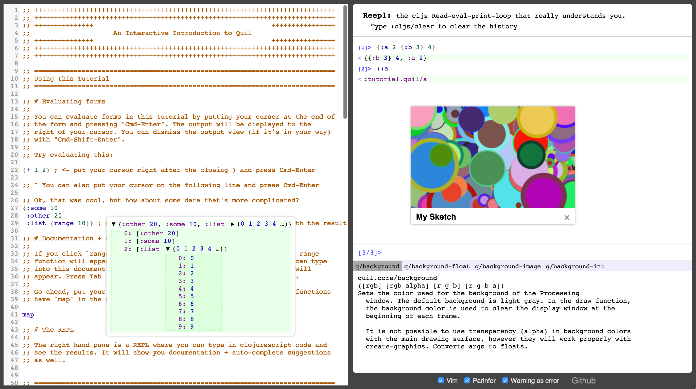

# Interactive ClojureScript Tutorial Environment

## [Try it Out](https://jaredforsyth.com/tutorial-cljs)

[Screencast](https://www.youtube.com/watch?v=DQSdW27Esto)

## To Build

Requires [boot](http://boot-clj.com).

- start a dev server `boot dev`
- build the project for hosting `boot doit`

## Powered By

- [Clojurescript](https://github.com/clojure/clojurescript)
- [Reepl](https://github.com/jaredly/reepl)
- [Boot](http://boot-clj.com/)
- [Reagent](http://reagent-project.github.io/) (which uses [React](https://facebook.github.io/react/))
- [Cljs-Devtools](https://github.com/binaryage/cljs-devtools/)
- [Parinfer](https://shaunlebron.github.io/parinfer/)
- [Replumb](https://github.com/ScalaConsultants/replumb/)
- [Quil](http://quil.info)
